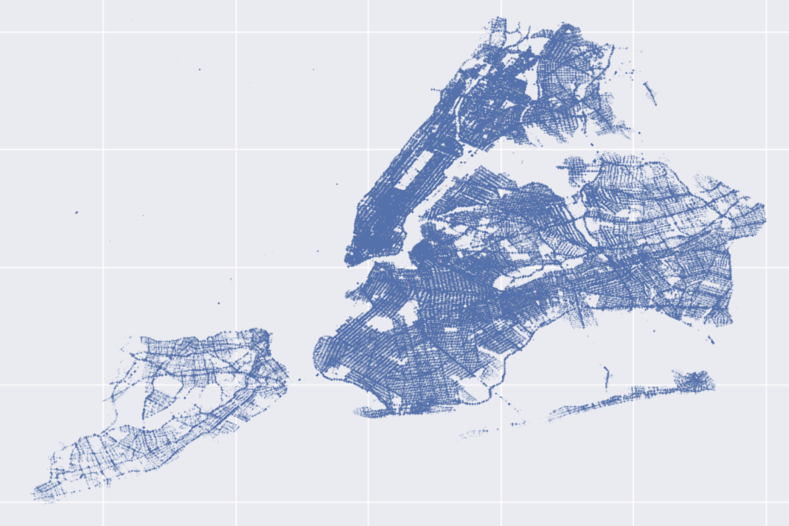

# NYC Traffic-Weather Risk Forecaster



This tool aims to provide visual interpretations to the risk of traffic incidents in New York City based on current weather conditions.

As one of the most densely populated cities with highly variable weather, it is of our interest to be able to identify how weather conditions affect particular regions in the city. A consequence of this is the ability to proactively station emergency resources accordingly to reduce response times to accident locations.

## Data
The data for the vehicle incidents has been drawn from [the NYC OpenData dataset on Motor Vehicle Collisions from 2013 - now](https://data.cityofnewyork.us/Public-Safety/Motor-Vehicle-Collisions-Crashes/h9gi-nx95/about_data), and the weather data has been drawn from the [OpenWeatherMap History Bulk Service](https://openweathermap.org/history-bulk).

## Suggestions for Future Work
This project primarily focuses on general accidents, not accounting for the severity of these accidents or the kinds of accidents. There's lots of room for extensions of this work. Some of which include focusing on **pedestrian-involved accidents**, **fatal accidents**, and the **likelihood of follow-up accidents** as a result of existing accidents ([you should read up on Hawkes processes -- I think they're fascinating \:) ](https://en.wikipedia.org/wiki/Hawkes_process))

## Setup

Below are steps to reproduce this project. 

### 0. Installing Dependencies

Install the required dependencies (as listed in `requirements.txt`)

```
pip install -r requirements.txt
```

### 1. Downloading Datasets

#### 1.1 Traffic Dataset
Download the traffic dataset (~450 MB):

https://data.cityofnewyork.us/Public-Safety/Motor-Vehicle-Collisions-Crashes/h9gi-nx95/about_data

It inherently contains lots of recorded metadata (vehicle types involved, number of vehicles, whether pedestrians were involved).

#### 1.2 Weather Dataset
The weather dataset is provided in the repository (~19MB)

It contains the following relevant hourly weather data:
- 1-hour rain forecast (mm/hr)
- 1-hour snow forecast (mm/hr)
- wind gust (km/hr)
- visibility (m): Maximum of 10,000m

### 2. Run Scripts (clean data, engineer features, train models)
The `scripts/` directory contains ordered scripts necessary to train the model

1. `scripts/01_process_raw_data.py`: Loads and cleans the raw data from both weather and traffic datasets. Merges the dataset into a single table containing accidents, their location, and the corresponding weather conditions at the time of the accident.

2. `scripts/02_aggregate_data.py`: Aggregates the datapoints based on coordinate bins.
    - By default, we create 5km x 5km bins (about 60 total bins) for the sake of computational limitations. As a result, the dataframe will contain information for every hour for every bin, i.e., `bin`, `hour`, `# accidents in bin`, `weather information`.

    - There are about 100k hours from 2013 to now (Sept 2025), which entails ***100k hours * number of bins (60) = 6 million datapoints.***

3. `scripts/03_feature_engineer.py`: Creates new spatial/temporal/auxiliary featuers and performs normalizations/transforms.
    - **spatial**: We create accident density (`accident_total_locations`), which is the historic total number of accidents in the bin.
    - **temporal**:
        - We create various sinusoidal features representing the cyclical nature of daily activities:
            - rush hour (likely more traffic)
            - school hours (likely less traffic)
            - late night (likely less traffic)

        - We also create lagged features that would be particularly useful for weather features such as `rain` and `snow`. *Immediate rain/snow is unlikely to create risky conditions, but consistent rain over a few hours is likely to do so.*
            - Thus, we include lagged features (1h, 2h, 3h by default -- the `--lag-hours` command line argument allows you to customize these hours)
    - **categorical encodings**: We include some one-hot encoded categorical features (e.g., rain, snow, wind, visibility intensity categories) for optional exploration of these features in capturing nonlinearities in the data.
        - An example of this motivation can be seen in the `Correspondence Analysis` section of `notebooks/3_timeseries_forecasting.ipynb`, where `heavy rain` is supposedly less-associated with risk than `moderate rain`, likely suggesting less people actually drive and/or people drive more cautiously during such conditions.

```
# Example call
python -m scripts.03_feature_engineer \
    --load ./data/processed/02_aggregated.csv \
    --save ./data/processed/03_features.csv \
    --config ./config/interaction_effects.yaml \
    --include-interactions \
    --include-lags
```

4. `scripts/04_train_nonspatial_model.py`: Runs [Bayesian inference](https://en.wikipedia.org/wiki/Bayesian_inference) using [PyMC](https://www.pymc.io/welcome.html).
    - ***Requires a config file name as a command line argument*** (see `config/models/`)
    
```
# Example call
python -m scripts.04_train_nonspatial_model.py --config-file model1.yml
```

```yml
# Example config template setup

# Overview (metadata)
name: non_spatial_model_1
description: "Simple model without spatial effects (includes 1M subsample of 6M total points)"
version: "0.1"

# Included features from dataframe
features: [rain, rain_lag_1h, rain_lag_2h, rain_lag_3h, snow, snow_lag_1h, snow_lag_2h, snow_lag_3h, visibility, is_rush_hour, is_weekend, location_total_accidents, is_late_night, is_school_hours, cos_day_of_year, sin_day_of_year, cos_hour, sin_hour, cos_day_of_week, sin_day_of_week]

# Prior specifications
priors:
  coefficients:
    rain:
      distribution: "Normal"
      params:
        mu: 0.1
        sigma: 0.3
    snow:
      distribution: "Normal"
      params:
        mu: 0.15
        sigma: 0.3
    visibility:
      distribution: "Normal"
      params:
        mu: -0.2
        sigma: 0.3

    location_total_accidents:
      distribution: "Normal"
      params:
        mu: 0.2
        sigma: 0.3

  default_coefficient: # all other features not specified will inherit this prior
    distribution: "Normal"
    params:
      mu: 0
      sigma: 0.5
  
  intercept:
    distribution: "Normal"
    params:
      mu: 0
      sigma: 1

# Model specifications
model:
  likelihood: "Poisson"
  link: "log"
  hierarchical: false

# Sampling
sampling:
  method: "advi" # 'advi' or 'mcmc'
  chains: 4 # only supported for 'mcmc'
  iterations: 20000
  warmup: 1000 # only supported for 'mcmc'
  target_accept: 0.95 # only supported for 'mcmc'
  max_treedepth: 10 # only supported for 'mcmc'

# Number of samples from the dataset (for )
num_samples: 1000000

```


